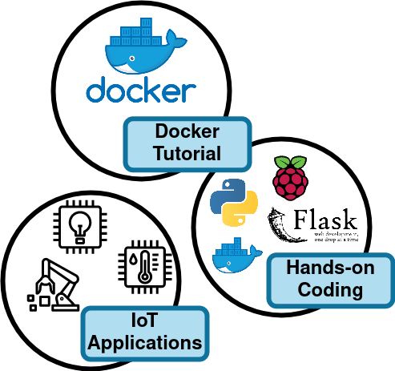

# RAINBOW-Tutorial-Hackathon-2022
## IoT/Docker tutorial and RAINBOW Hackathon

The Internet of Things (IoT) is a fast-growing technology where smart devices, such as environmental sensors, medical monitors, 
smart house gadgets, and industrial sensors, interact with the environment, building cyber-physical applications. 
Moreover, developers are increasingly implementing applications by adopting containerization technologies, like the Docker platform. 
Docker is an open platform for container-based virtualization and offers the most well-known containerization ecosystem. 
Specifically, docker containers are a lightweight virtualization solution that developers can use to quickly design, test, deploy, and update applications. 
The ability of docker containers to run almost anywhere, even on IoT devices, makes the combination of containers and IoT devices a common practice in the industrial IoT applications.

## Description

This tutorial introduces IoT technologies and respective IoT applications to the audience, 
and provides hands-on exercises for the Docker ecosystem and how one can implement containerized applications. 
Moreover, our tutorial offers information about docker image creation, lifecycle of a container including properties 
introduction like environmental variables, files and folders injection to the execution environment, network port forwarding, 
and a basic introduction of docker-compose files. 
Furthermore, this repo includes hackathon tasks, 
through which the participants utilize an already created example of an IoT application 
in order to extend it, build the respective docker image, run it on top of real IoT devices (raspberry Pis) 
and process data from real sensors (e.g., cameras, sonar sensors, etc.). 
Finally, the hackathon artifacts include the deployment of the application via RAINBOW platform 
and performing a simple task on it (e.g., extraction of custom metrics or a scaling action).

## Organizers

